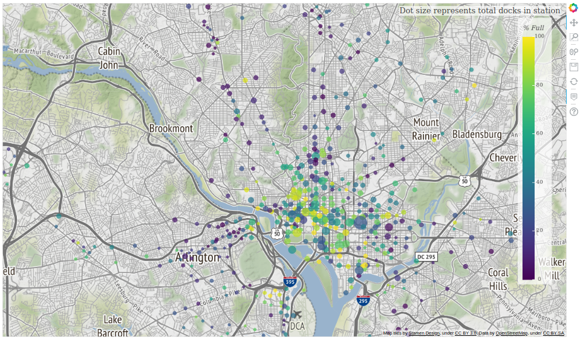

# Bikeshare Web App

This Bokeh web application displays bikeshare availability data on an interactive map. Color and size of the dots are used to visually indicate the percentage of bikes available and the total number of docks in a given station. The `pybikes` library is used to scrape the bike sharing data, and the data displayed in the app is updated at periodic (2 minute) intervals.

## Installation

Clone the repo with the command:

`git clone https://github.com/keves1/bikeshareapp.git`

Create a virtual environment with Python 3:

`conda create -n myenv python=3.7`

Follow the instructions [here](https://github.com/eskerda/pybikes) to install pybikes (works using Python 3 despite note in readme).

Install bokeh:

`conda install bokeh==1.4.0`

## Usage

To run the web app, navigate to the directory of the cloned repository and run the command:

`bokeh serve --show bikeshareapp`